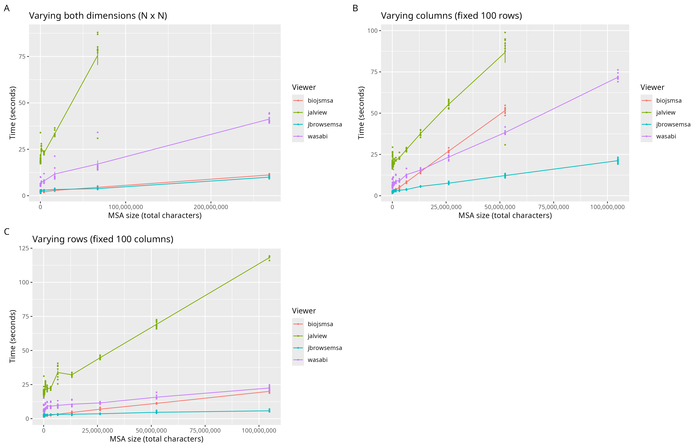

## msa-viewer-benchmark

## Main "result" figure



## Preparation

```sh
./prep.sh # prepares files and uploads them to the jbrowse s3 bucket
./bench.sh # all msa tools are hosted on the web, not locally, and get links to the s3 ucket
```

The benchmark runs 10 times on each of the square, varying rows, and varying
columns datasets. It uses puppeteer to automatically load the webpage and detect
'done-ness' (initial load of data). It generates output figures in the img
folder

The last run of the benchmark was done 2025/01/08

## Speed per character

```
  Rscript lm.R


  [1] "varyXY"

  Summary of slopes:
    biojsmsa    jalview jbrowsemsa     wasabi
    34.04382  821.38408   27.44411  128.64011
  [1] "varyX"

  Summary of slopes:
    biojsmsa    jalview jbrowsemsa     wasabi
    946.2679  1298.7829   179.3135   615.0658
  [1] "varyY"

  Summary of slopes:
    biojsmsa    jalview jbrowsemsa     wasabi
   173.41231  934.43469   31.10725  148.59521
```

## Footnotes

The benchmarks do access the network and even just whatever version of the
webapp is deployed at the time , so the tools are not locked down version-wise

Further work to re-host all tools locally could be done for a fully reproducible
benchmark
